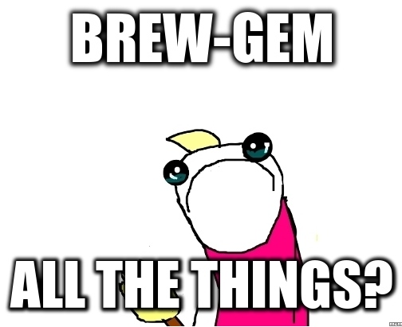

!SLIDE title-slide

# What's Brewing with brew-gem

!SLIDE center transition=uncover

## What the hell is
## 'brew-gem'

!SLIDE center transition=uncover

## It's the developer friendlyness of
## [Homebrew](http://brew.sh/)

!SLIDE center transition=uncover

## Mixed with the ease of maintainability of
## [Rubygems](http://rubygems.org/)

!SLIDE center transition=uncover

## Why not one or the other?

!SLIDE center transition=uncover

## Homebrew locks us into a single distribution model

!SLIDE center transition=uncover

## Rubygems suffers from client upgrade hell

!SLIDE center transition=uncover

!SLIDE transition=uncover

!SLIDE transition=uncover

!SLIDE center transition=uncover

# No

!SLIDE center transition=uncover

## Bunder is still useful for app specific gems

!SLIDE center transition=uncover

## Did I hear brew-gem uses system ruby?

!SLIDE center transition=uncover

!SLIDE center transition=uncover

## Yes but system ruby for Mavericks is a modern ruby(2.0)

!SLIDE center transition=uncover

## Srsly system ruby?
